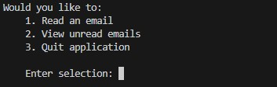
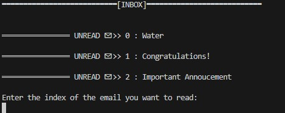
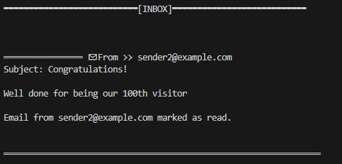

# OOP - Classes
Using OOP to build out an email simulator.

## Description
Had to add an email class and initialise a constructor that takes in three arguments:
- email_address - the email address of the sender.
- subject_line - the subject line of the email.
- email_content - the contents of the email.
The email class contained the class variable and default value:
- has_been_read - initialised to False.
I then added the method to edit the values of email objects.
- mark_as_read which changes has_been_read to true

I then created the following functions:
- populate_inbox() - creates an email object with the email address, subject line and contents, and stores
it in the inbox list. This runs at startup.
- list_emails() - loops through the inbox and prints each email's subject line with a index number.

- read_email - displays the selected email, together with the email_address, subject_line and email_content,
and then sets its has_been_read to True.

## Project Usage
This repository exists as part of my Technical Portfolio with HyperionDev Software Engineering Bootcamp, and remains to
showcases for potential employers my ability to work with classes and object oriented programming.
